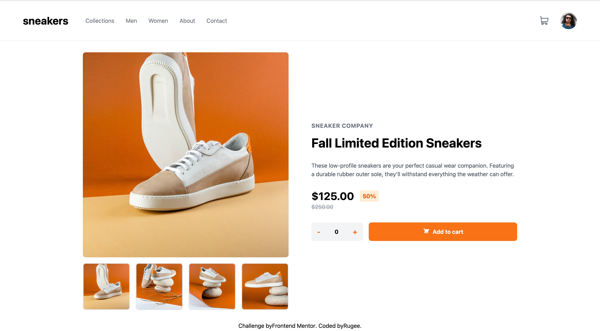

# Frontend Mentor - E-commerce product page solution

This is a solution to the [E-commerce product page challenge on Frontend Mentor](https://www.frontendmentor.io/challenges/ecommerce-product-page-UPsZ9MJp6). Frontend Mentor challenges help you improve your coding skills by building realistic projects.

## Table of Contents

- [Overview](#overview)
  - [The Challenge](#the-challenge)
  - [Screenshot](#screenshot)
  - [Links](#links)
- [My Process](#my-process)
  - [Built With](#built-with)
  - [What I Learned](#what-i-learned)
  - [Continued Development](#continued-development)
  - [Useful Resources](#useful-resources)
- [Author](#author)

---

## Overview

### The Challenge

Users should be able to:

- View the optimal layout for the component depending on their device's screen size.

### Screenshot

Add a screenshot of your solution here. Use tools like Snipping Tool, Lightshot, or any screen capture tool to capture the screenshot and save it to the repository.

---

### Links

- Solution URL: [GitHub Repository](https://github.com/RugeeFan/ecommence-product-page)
- Live Site URL: [Live Site](ecommerce-product-page-main-dun.vercel.app)

---

## My Process

### Built With

- Semantic HTML5 markup
- Tailwind CSS
- Flexbox
- [Vite](https://vitejs.dev/) - Frontend tooling
- React.js

---
